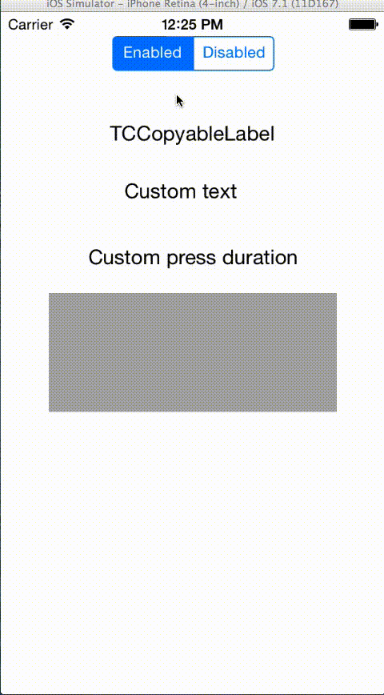
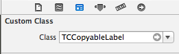

# TCCopyableLabel

#### Provide the best UX to your users!

TCCopyableLabel is a subclass of `UILabel` that allows a user to copy the label's text to the clipboard, just like a regular text input. This can be really useful in some situations where you dispplay some important real-life informations.



Inspired from [Mattt Thompson](http://mattt.me/)'s article about copyable labels I read in his great [NSHipster book](https://gumroad.com/l/nshipster).

- Compatible with Interface Builder.
- Custom string to be copied in the clipboard instead of the label's text (perform formatting to make your user's life easier).
- Delegate and block on copy events.
- Press to copy duration is customizable.

## Documentation :books:

Browse the documentation on [Cocoadocs](http://cocoadocs.org/docsets/TCCopyableLabel) or add it directly to Xcode by [downloading](https://github.com/thibaultCha/TCCopyableLabel/blob/master/Docs/TCCopyableLabel.zip?raw=true) the docset and placing it into `~/Library/Developer/Shared/Documentation/DocSets/`. (or use the great [Dash](http://kapeli.com/dash))

## Installation

### Cocoapod

Add the following to your Podfile and run `$ pod install`:

```ruby
pod 'TCCopyableLabel'
```

If you don't have CocoaPods installed or integrated into your project, you can learn how to do so [here](http://cocoapods.org).

### Static files

Copy/paste `TCCopyableLabel/TCCopyableLabel/TCopyableLabel.{h,m}` class in your project.

Import the class:

`#import "TCCopyableLabel.h"`

## Examples

Instanciate it as you would do with a regular `UILabel`:

```objective-c
TCCopyableLabel *copyableLabel = [[TCCopyableLabel alloc] init];
[copyableLabel setText:@"Important stuff"];

// customization stuff
[copyableLabel setMinimumPressDuration:3];
[copyableLabel setCustomString:@"Custom string to be copied"];
```

If you are using Interface Builder, don't forget to add `TCCopyableLabel` in the class field:



If you wish to perform something once a particular label has been copied, you can do so using the `TCCopyableLabelDelegate` or the `copiedBlock` property:

```objective-c
TCCopyableLabel *copiableLabel1 = [[TCCopyableLabel alloc] initWithFrame:frame delegate:self];

TCCopyableLabel *copyableLabel2 = [[TCCopyableLabel alloc] initWithFrame:frame  copiedBlock:^(NSString *copiedString) {
  // do stuff
}];
```
